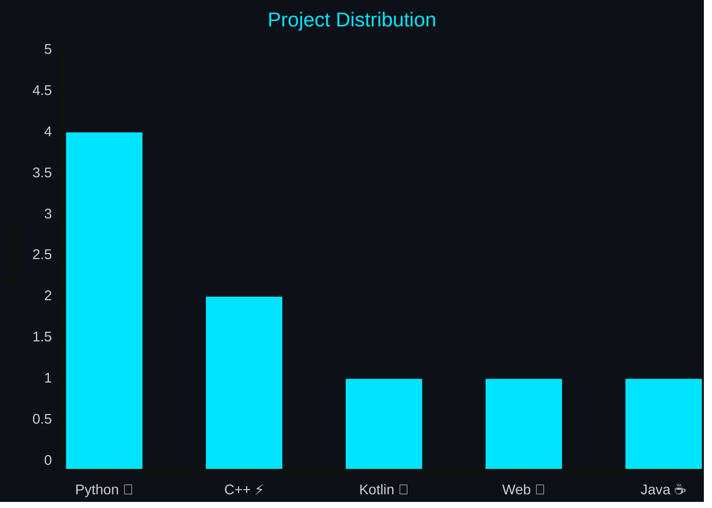

# Hey there, I'm Muhammad Shah Nawaz 👋

### 💫 About & What I Do

> Software Engineering student focused on turning complex problems into elegant, scalable solutions. From low-level system logic to rich interactive interfaces, I build software that matters.

<table border="0">
  <tr>
    <td width="60%">
      <ul>
        <li>⚡ <b>Architecture:</b> Scalable systems with OOP & SOLID</li>
        <li>📱 <b>Mobile:</b> Native Android experiences with Kotlin</li>
        <li>🧠 <b>AI & Data:</b> Predictive models & smart dashboards</li>
      </ul>
    </td>
    <td width="40%" align="center">
      
    </td>
  </tr>
</table>

---

### ⚙️ Software Engineering Core

| Engineering Phase | Description |
| :--- | :--- |
| 📋 **Analysis & Design** | Refining requirements, creating architectures, and modelling UI/UX (Figma, UML) |
| 💻 **Development** | Crafting clean, documented, and maintainable systems using modern design patterns |
| 🧪 **Testing & QA** | Ensuring software reliability through automated testing frameworks (Selenium, TestOps) |
| 🚀 **Management** | Planning agile sprints, version control, and ensuring seamless deployment workflows |

---

### 🛠️ Tech Stack

| Languages | Frameworks & DB | Design | DevTools |
|:---------:|:---------------:|:------:|:--------:|
|  |  |  |  |
|  | | | |

---

### 🚀 Featured Projects

| | Project | Stack | |
|:-:|:--------|:------|:-:|
| 📱 | **Mini Instagram** | `Kotlin` `Firebase` | [View →](https://github.com/mshahnawaz1202/Mini-Instagram) |
| 📊 | **AI Analysis Dashboard** | `Python` `Streamlit` `Scikit-Learn` | [View →](https://github.com/mshahnawaz1202/-AI-Data-Analysis-Prediction-Dashboard) |
| 🖥️ | **Mini Operating System** | `C++` `Batch` | [View →](https://github.com/mshahnawaz1202/Mini-Operating-System) |
| 🤖 | **Jarvis AI Assistant** | `Python` `SpeechRecognition` | [View →](https://github.com/mshahnawaz1202/Jarvis) |
| 🧪 | **TestOps Framework** | `Python` `Selenium` | [View →](https://github.com/mshahnawaz1202/TestOps-andAutomation-Framework) |
| 📜 | **Arabic Poetry Manager** | `Python` `MySQL` | [View →](https://github.com/mshahnawaz1202/Arabic-Poetry-Management-System) |
| 🎲 | **Ludo Gold** | `Python` `Pygame` | [View →](https://github.com/mshahnawaz1202/Ludo-Gmae-In-Python) |

---

### 📊 Projects by Language

### 📈 GitHub Stats

### 🤝 Connect

*"Code is poetry written for machines, read by humans."*

