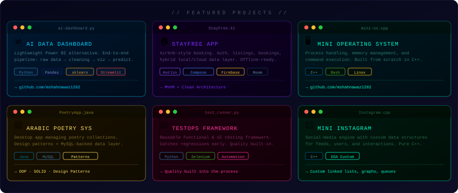
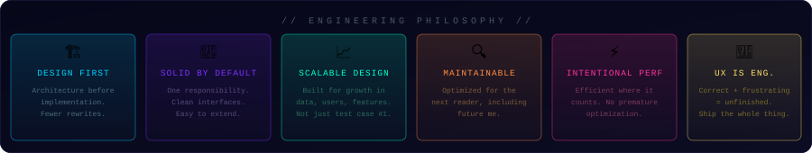

<div align="center">

<!-- ═══════════════════════════════════════════════════════════════ -->
<!--                        HERO BANNER                            -->
<!-- ═══════════════════════════════════════════════════════════════ -->



</div>

<br>

<!-- ═══════════════════════════════════════════════════════════════ -->
<!--                     CONNECT WITH ME                             -->
<!-- ═══════════════════════════════════════════════════════════════ -->

<div align="center">

[](https://linkedin.com/in/muhammad-shah-nawaz-491701340)&nbsp;
[](https://github.com/mshahnawaz1202)&nbsp;
[](mailto:shahnawaz.swz1202@gmail.com)

</div>

<br>

---

<!-- ═══════════════════════════════════════════════════════════════ -->
<!--                        ABOUT                                    -->
<!-- ═══════════════════════════════════════════════════════════════ -->

```
╔══════════════════════════════════════════════════════════════════════════╗
║  SYSTEM LOG :: ENGINEER PROFILE                         STATUS: ACTIVE   ║
╠══════════════════════════════════════════════════════════════════════════╣
║                                                                          ║
║  > I design before I code. Architecture before implementation.           ║
║  > Most engineers build software. I build software that lasts.           ║
║  > SOLID by default. Scalable by design. Maintained with intent.         ║
║                                                                          ║
║  PRIMARY:   Python — ML, data analysis, automation                       ║
║  MOBILE:    Kotlin + Android, Firebase                                   ║
║  SYSTEMS:   C++ — clean architecture, memory, processes                  ║
║  TESTING:   Selenium — quality built in, not bolted on                   ║
║  WEB DEV:   HTML5, CSS3, Javascript, ReactJS, Django                     ║
║                                                                          ║
╚══════════════════════════════════════════════════════════════════════════╝
```

<br>

<!-- ═══════════════════════════════════════════════════════════════ -->
<!--                   CURRENTLY BUILDING                          -->
<!-- ═══════════════════════════════════════════════════════════════ -->

<details>
<summary><b>⚡ &nbsp; CURRENT MISSION LOGS &nbsp; ⚡</b></summary>

<br>

| `STATUS` | `MISSION` | `DOMAIN` |
|:---:|:---|:---:|
| 🟢 `ACTIVE` | Sharpening Python-based ML & data analysis through real-world projects | `AI / DATA` |
| 🟢 `ACTIVE` | Deepening expertise in software architecture & design patterns | `ARCHITECTURE` |
| 🔵 `ONGOING` | Exploring Android architecture patterns — MVVM, Clean Architecture | `MOBILE` |
| 🔵 `ONGOING` | Embedding automated testing into every project with Selenium | `QUALITY` |

</details>

<br>

---

<!-- ═══════════════════════════════════════════════════════════════ -->
<!--                           TECH STACK                            -->
<!-- ═══════════════════════════════════════════════════════════════ -->

<div align="center">

### `> TECHNOLOGY DOMAINS`



</div>

<br>

<!-- ═══════════════════════════════════════════════════════════════ -->
<!--                   DETAILED TECH STACK                         -->
<!-- ═══════════════════════════════════════════════════════════════ -->

<details>
<summary><b>🛠️ &nbsp; FULL ARSENAL — EXPAND STACK &nbsp; 🛠️</b></summary>

<br>

<div align="center">

**`// LANGUAGES //`**


**`// ANDROID & MOBILE //`**


**`// AI & DATA SCIENCE //`**


**`// BACKEND & WEB //`**


**`// TOOLS & WORKFLOW //`**


**`// ENGINEERING CRAFT //`**


</div>

</details>

<br>

---

<!-- ═══════════════════════════════════════════════════════════════ -->
<!--                    FEATURED PROJECTS                          -->
<!-- ═══════════════════════════════════════════════════════════════ -->

<div align="center">

### `> FEATURED PROJECTS`



</div>

<br>

<!-- project detail links row -->
<div align="center">

[](https://github.com/mshahnawaz1202/-AI-Data-Analysis-Prediction-Dashboard)&nbsp;
[](https://github.com/mshahnawaz1202/Mini-Operating-System)&nbsp;
[](https://github.com/mshahnawaz1202/Arabic-Poetry-Management-System)

[](https://github.com/mshahnawaz1202/TestOps-andAutomation-Framework)&nbsp;
[](https://github.com/mshahnawaz1202/Mini-Instagram)

</div>

<br>

---

<!-- ═══════════════════════════════════════════════════════════════ -->
<!--                 ENGINEERING PHILOSOPHY                        -->
<!-- ═══════════════════════════════════════════════════════════════ -->

<div align="center">

### `> ENGINEERING PHILOSOPHY`



</div>

<br>

---

<!-- ═══════════════════════════════════════════════════════════════ -->
<!--                   GITHUB ANALYTICS                            -->
<!-- ═══════════════════════════════════════════════════════════════ -->

<div align="center">

### `> SYSTEM ANALYTICS`

<br>


<br><br>


<br><br>

[](https://github.com/mshahnawaz1202)

</div>

<br>

---

<!-- ═══════════════════════════════════════════════════════════════ -->
<!--                             CONTACT                             -->
<!-- ═══════════════════════════════════════════════════════════════ -->

```
╔══════════════════════════════════════════════════════════════════════════╗
║  TRANSMISSION CHANNEL                              ENCRYPTION: ENABLED  ║
╠══════════════════════════════════════════════════════════════════════════╣
║                                                                          ║
║  📡  OPEN TO: Internships · Collaborations · Engineering conversations   ║
║                                                                          ║
║  ✉️   shahnawaz.swz1202@gmail.com                                        ║
║  🔗  linkedin.com/in/muhammad-shah-nawaz-se/                             ║
║  💻  github.com/mshahnawaz1202                                           ║
║                                                                          ║
╚══════════════════════════════════════════════════════════════════════════╝
```

<div align="center">

<br>

[](https://linkedin.com/in/muhammad-shah-nawaz-491701340)&nbsp;
[](https://github.com/mshahnawaz1202)&nbsp;
[](mailto:shahnawaz.swz1202@gmail.com)

<br>


<br>


## 🐍 Contribution Snake

<p align="center">
  
</p>

```
// END OF PROFILE TRANSMISSION //
```

</div>
